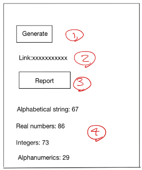

# Random-Generator

## Author
- [Raihanul Alam Hridoy](https://www.facebook.com/hridoy100)

## Client:

### Installation:

Change Directory into `cd client`

Run `npm install`. It will install the necessary packages.

### Execution:

Now run the frontend application using command:
```aidl
npm run serve
```
The server runs in url: [http://localhost:8080](http://localhost:8080)

## Backend:

### Installation:

Change Directory into root folder.

Run `npm install`. It will install the necessary packages.


### Execution:

The server uses nodemon to check any changes on code. For running the server use command:

```nodemon run serve```

## Code Description:

### Regular Expressions:
- Alphanumeric Strings Matcher: `^(?=.*[a-zA-Z])(?=.*[0-9])[a-z0-9]+$`
- String Matcher: `^[a-z]+$`
- Integer: `^(-?[0-9]+)$`
- Real Numbers: `^[0-9]*\.[0-9]+$`

### Cases Not Considered:
- Integers can have **+** sign in front of them. We considered minus sign.
- In mathematics, integers are in the set of real numbers. But here considered real numbers to be fractional. 
But max 5 characters after decimal point.
- Real numbers can also be positive or negative. That case is not considered currently.

## Requirements:
Write a Web app to generate four (4) types of printable random objects and store them in a single file, each object will be separated by a ",".  These are the 4 objects: alphabetical strings, real numbers, integers, alphanumerics.

Sample extracted output:

hisadfnnasd, 126263, assfdgsga12348fas, 13123.123,
lizierdjfklaasf, 123192u3kjwekhf, 89181811238,122,
nmarcysfa900jkifh, 3.781, 2.11, ....



The output should be 2MB in size. Once file generation is done the output should be available as a link which can be then downloaded by clicking on it.
Also, there should be a Report button on the page.  When clicked, the page should show the total count of generated objects.


**Implementation:** The backend API of the web app should be written using python or node js.

**Submission:** Upload the project in Github and share the link with us.  
Your submission should include a README file that contains clear and complete instructions required to run and test your web app. 

Assessment by: [© Omnilytics 2021](https://docs.google.com/document/d/1RvJaYLFOp7uOydSk8Cy7dMBJh2jz0GZ4_4DqbzhH7JE/edit#)